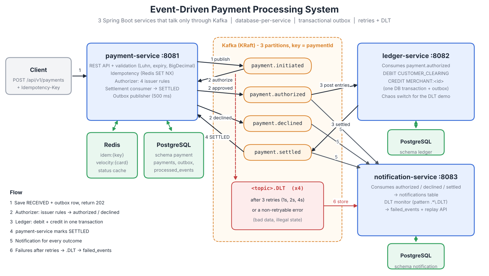

# Event-Driven Payment Processing System

A production-style card payment backend: **3 Spring Boot microservices that talk only through Kafka**, with no double charges (Redis idempotency + consumer de-duplication), automatic retries with exponential backoff and dead-letter topics, a double-entry ledger in PostgreSQL, and CI quality gates.

<!-- Replace YOUR_GITHUB_USER / project key after pushing to GitHub and importing into SonarCloud -->
[](https://github.com/YOUR_GITHUB_USER/event-driven-payment-system/actions/workflows/ci.yml)
[](https://sonarcloud.io/summary/new_code?id=YOUR_GITHUB_USER_event-driven-payment-system)
[](https://sonarcloud.io/summary/new_code?id=YOUR_GITHUB_USER_event-driven-payment-system)

> **New here? Read [`SETUP_AND_RUN_GUIDE.md`](SETUP_AND_RUN_GUIDE.md)** — step-by-step local setup, troubleshooting, full validation checklist and a walkthrough of everything happening inside the system.

## Architecture



One payment, end to end:

1. The client POSTs a payment. `payment-service` checks the `Idempotency-Key` in Redis, saves the payment as **RECEIVED** together with a `payment.initiated` outbox row (one transaction) and returns **202**.
2. The outbox publisher sends `payment.initiated`. The authorizer (inside `payment-service`) applies the issuer rules and publishes `payment.authorized` or `payment.declined`.
3. `ledger-service` consumes `payment.authorized`, writes **DEBIT CUSTOMER_CLEARING / CREDIT MERCHANT:&lt;id&gt;** in one transaction and publishes `payment.settled`.
4. `payment-service` consumes `payment.settled` and marks the payment **SETTLED**.
5. `notification-service` consumes every outcome and saves a merchant notification.
6. Anything that still fails after 3 retries (1 s, 2 s, 4 s) goes to its `.DLT` topic and is stored in `failed_events`, from where it can be replayed.

## Tech stack

| Layer | Tool | Why |
|---|---|---|
| Language | Java 17 | Records for events, switch expressions, LTS |
| Framework | Spring Boot 3.3 (Web, Validation, Actuator, Data JPA) | REST, validation, health checks |
| Messaging | Apache Kafka 3.7 (KRaft) + Spring for Apache Kafka | Event-driven communication, retries, DLT |
| Relational DB | PostgreSQL 16 + Flyway | ACID money movement, versioned schema, one schema per service |
| Key-value | Redis 7 | Idempotency keys (SET NX + TTL), velocity counter, status cache |
| Build | Maven multi-module (`common`, `payment-service`, `ledger-service`, `notification-service`) | One repo, shared event contract |
| Containers | Docker + Docker Compose | One command starts everything |
| Tests | JUnit 5, Mockito, AssertJ, Testcontainers, Awaitility | Unit, slice and real-infrastructure integration tests |
| Quality | JaCoCo (80% line gate), SonarCloud, GitHub Actions | Build fails on low coverage / failed quality gate |
| Load | k6 | TPS and p99 latency |
| Docs / metrics | springdoc-openapi (Swagger UI), Micrometer + Prometheus endpoint | Try the API in a browser; end-to-end settlement timer |

## Run it locally

Prerequisites: Docker Desktop (with ~6 GB RAM), Git. JDK 17 + Maven 3.9 only if you want to run the tests.

```bash
git clone https://github.com/YOUR_GITHUB_USER/event-driven-payment-system.git
cd event-driven-payment-system
docker compose up -d --build        # first build takes a few minutes
docker compose ps                   # wait until the 3 services are "healthy"
```

Create a payment and watch it settle:

```bash
curl -i -X POST http://localhost:8081/api/v1/payments \
  -H "Content-Type: application/json" \
  -H "Idempotency-Key: 3f0c8a52-7d1e-4e7b-9a43-1b2c3d4e5f60" \
  -d '{"merchantId":"MER-1001","cardNumber":"4111111111111111","expiryMonth":12,"expiryYear":2028,"amount":2499.00,"currency":"INR"}'

curl http://localhost:8081/api/v1/payments/<paymentId>        # RECEIVED -> AUTHORIZED -> SETTLED within ~1-2 s
curl http://localhost:8082/api/v1/ledger/payments/<paymentId>/entries
curl "http://localhost:8083/api/v1/notifications?merchantId=MER-1001"
```

| URL | What |
|---|---|
| http://localhost:8080 | Kafka UI (topics, messages, consumer lag) |
| http://localhost:8081/swagger-ui.html | payment-service API |
| http://localhost:8082/swagger-ui.html | ledger-service API |
| http://localhost:8083/swagger-ui.html | notification-service API |

Full functional check: import `postman/Event-Driven-Payment-System.postman_collection.json` and run it with the Collection Runner (39 requests, all assertions automated), or run `./scripts/smoke-test.sh`.

## REST API

| Service | Method and path | Notes |
|---|---|---|
| payment | `POST /api/v1/payments` | `Idempotency-Key` (UUID) header required; 202 + `RECEIVED` |
| payment | `GET /api/v1/payments/{id}` | Redis cache first, then PostgreSQL |
| payment | `GET /api/v1/payments?merchantId=&page=&size=` | Newest first, max 100 per page |
| ledger | `GET /api/v1/ledger/payments/{paymentId}/entries` | 2 entries per settled payment |
| ledger | `GET /api/v1/ledger/merchants/{merchantId}/balance` | Credits − debits, per currency |
| ledger | `GET /api/v1/ledger/trial-balance` | Total debits must equal total credits |
| ledger | `GET/PUT /api/v1/admin/chaos` | Demo failure injection for the DLT demo |
| notification | `GET /api/v1/notifications?merchantId=&paymentId=` | Read-only |
| notification | `GET /api/v1/admin/failed-events`, `POST /api/v1/admin/failed-events/{id}/replay` | DLT review and replay |

Errors always look like `{"code": "...", "message": "...", "field": "...", "timestamp": "..."}`.

**Test cards** — `4111111111111111` approves · `4000000000000002` (ends 0002) → `INSUFFICIENT_FUNDS` · amount > 50000 → `LIMIT_EXCEEDED` · more than 5 payments on one card in 60 s → `VELOCITY_CHECK_FAILED`.

## Key design decisions

**Idempotency — no double charges (two layers).**
*API layer:* `SET idem:{key} IN_PROGRESS:{sha256(body)} NX EX 86400`. Winner processes and stores `DONE:{hash}:{response}`; a repeat gets the stored response with `Idempotent-Replayed: true`; same key + different body → 422; still running → 409; failure → key deleted so the client can retry. The `UNIQUE(idempotency_key)` constraint in PostgreSQL is the backstop if Redis is flushed.
*Consumer layer:* every consumer inserts the `eventId` into its own `processed_events` table **in the same transaction** as its business write (`INSERT … ON CONFLICT DO NOTHING`), so a redelivered event is skipped. The ledger's `UNIQUE(payment_id, account, direction)` is a second guard.

**Retries and dead-letter topics.** `DefaultErrorHandler` + `ExponentialBackOffWithMaxRetries(3)` (1 s, 2 s, 4 s) + `DeadLetterPublishingRecoverer` to `<topic>.DLT` on the same partition. `ValidationException`, `IllegalStateTransitionException` and `DeserializationException` are not retried (retrying cannot fix bad data and would block the partition). `notification-service` subscribes to `.*\.DLT`, stores each message in `failed_events` and exposes a replay endpoint.

**Transactional outbox (dual-write problem).** A DB commit and a Kafka send cannot be one transaction. Events are written to an `outbox` table in the same transaction as the business change; a scheduled publisher (every 500 ms, `FOR UPDATE SKIP LOCKED`) sends them and marks them sent. Delivery is at-least-once; consumer de-duplication makes processing effectively exactly-once.

**State machine.** `RECEIVED → AUTHORIZED → SETTLED` or `RECEIVED → DECLINED`; allowed moves live in `PaymentStatus.canMoveTo`, illegal ones throw `IllegalStateTransitionException`. JPA `@Version` gives optimistic locking. All Kafka messages use `paymentId` as key, so one payment's events stay ordered on one partition. Producers use `acks=all` and `enable.idempotence=true`.

**SOLID.** `AuthorizationRule` interface with one class per issuer rule, injected as a list into `AuthorizationService` (open/closed). Kafka listeners only delegate to services (single responsibility).

**Card-data safety.** The full card number is never stored or logged: only `**** 1111` and an HMAC fingerprint (for the velocity rule) are stored, a Logback converter masks any 13–19 digit number in every log line, `PaymentRequest.toString()` masks the card, and money is always `BigDecimal`.

### Why these data stores

| Need | Store | Reason |
|---|---|---|
| Payments, ledger entries, outbox, processed events | PostgreSQL | ACID transactions, unique constraints; debit and credit must commit together |
| Idempotency keys | Redis | Atomic `SET NX` with automatic expiry; fast on every request |
| Velocity counter | Redis | `INCR` + `EXPIRE` is a ready-made window counter |
| Payment status reads | Redis cache (5 min TTL, evicted after commit on every status change) | Read far more often than it changes |

Redis is never the source of truth: if it is wiped, PostgreSQL still holds every payment and the unique constraint still blocks duplicates. Each service has its own schema and DB user (`payment_svc`, `ledger_svc`, `notification_svc`), so no service *can* read another's tables.

## Testing

```bash
mvn verify            # unit + integration tests (needs Docker running) + JaCoCo 80% gate
mvn test              # unit tests only (no Docker needed)
```

| Type | Examples |
|---|---|
| Unit (JUnit 5 + Mockito) | Every issuer rule (`@ParameterizedTest`), every legal/illegal `PaymentStatus` move, Luhn + expiry validation, card masking, idempotency (new / replay / 409 / 422 / failure), outbox publisher, ledger posting |
| Slice | `@WebMvcTest` controllers (202, 400s, 404, 409, 422, 503); `@DataJpaTest` + Testcontainers (unique idempotency key, `@Version` stale update) |
| Integration (Testcontainers: Kafka, PostgreSQL, Redis + Awaitility) | POST → AUTHORIZED → SETTLED; same event twice → still 2 ledger rows; consumer failure → 3 retries → `.DLT`; 50 payments → total debits = total credits; poison message → DLT → `failed_events` → replay |

Coverage report: `*/target/site/jacoco/index.html`. Only classes without logic (DTOs, `config`, `*Application`) are excluded.

## Performance

Measured with `load-test/payment-load.js` (k6, constant arrival rate, 30 s warm-up + 2 min steady). Procedure and the results table are in [`load-test/RESULTS.md`](load-test/RESULTS.md).

| Metric | Value |
|---|---|
| Sustained throughput | _fill in from your k6 run_ |
| p50 / p95 / p99 (POST → 202) | _fill in_ |
| Error rate | _fill in_ |
| Machine | _CPU, cores, RAM, OS_ |

The latency is the API accepting a payment (202); settlement completes asynchronously. `payments_settlement_duration_seconds` on `/actuator/prometheus` gives the end-to-end RECEIVED → SETTLED time.

## What I would add next

Schema Registry with Avro, refunds/reversals, Kubernetes manifests with horizontal scaling of consumers, Redis cluster, and authentication on the admin endpoints.

## License

MIT
